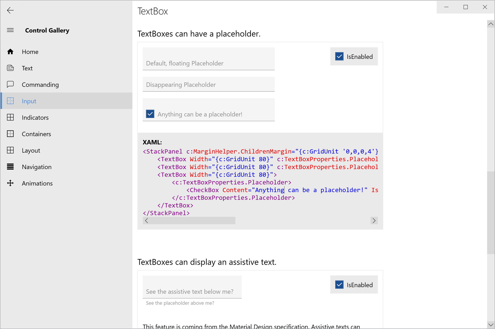

# Celestial.UIToolkit
A custom WPF toolkit which is inspired by a lot of the current design languages, including Microsoft's Fluent Design and Google's Material Design.

[](https://dev.azure.com/ManuelRoemer/Celestial%20UIToolkit/_build/latest?definitionId=2)
[](https://www.nuget.org/packages/Celestial.UIToolkit.Core/)
[](https://www.nuget.org/packages/Celestial.UIToolkit/)


## Table of Contents
* [1. Getting started](#1-getting-started)
  * [1.1 What is Celestial.UIToolkit?](#11-what-is-celestialuitoolkit)
  * [1.2 Installation and Requirements](#12-installation)
  * [1.3 Minimum System Requirements](#13-minimum-system-requirements)
  * [1.4 Which DLL do I need?](#14-which-dll-do-i-need)
  * [1.5 The Control Gallery](#15-the-control-gallery)


## 1. Getting Started
### 1.1 What is Celestial.UIToolkit?
There are amazing UI Frameworks for WPF out there, like *MahApps.Metro* or *MaterialDesignInXaml*.
None of these fulfilled all requirements for an upcoming project of mine though.

Thus, this project was born. It started out as a library of custom styles, but quickly
developed certain features that are also useable by other libraries or projects.

It provides a vast set of utilities for the day-to-day WPF development, custom animations (for 
instance `BrushAnimation` classes), a set of standard converters, a Behavior API, a lot of
modern controls, custom and consistent styles for all types of controls and lots of other features.

### 1.2 Installation
The libraries can be installed via NuGet (preferred way), or via
[GitHub Releases](https://github.com/manuelroemer/Celestial.UIToolkit/releases/latest).

*Unsure about what to install? See [Section 1.4](#14-which-dll-do-i-need) for details.*

#### Install the whole toolkit:
```
Install-Package Celestial.UIToolkit
```

#### Install only the Core library:
```
Install-Package Celestial.UIToolkit.Core
```

#### Install the Control Gallery:

The *Control Gallery* application (the toolkit's interactive companion) can be downloaded on 
[GitHub Releases](https://github.com/manuelroemer/Celestial.UIToolkit/releases/latest).

### 1.3 Minimum System Requirements

| Component                    | Minimum .NET Framework Requirement(s) |
| ---------------------------- | ------------------------------------- |
| `Celestial.UIToolkit.Core`   | .NET 4.5                              |
| `Celestial.UIToolkit`        | .NET 4.5                              |
| Control Gallery              | .NET 4.6                              |
| Solution (for custom builds) | .NET 4.6                              |

### 1.4 Which DLL do I need?
In most cases, you will want to install the `Celestial.UIToolkit` library, since it provides every single feature of the toolkit. 
If you don't require any styles or custom controls for your project, you only need the `Celestial.UIToolkit.Core` library.

See the following image for a basic overview of the features:


### 1.5 The Control Gallery
The Control Gallery is a demo application built upon the toolkit. It displays most of the available
controls and styles, which allows you to *directly interact* with them.

In addition, thanks to the amazing [ShowMeTheXaml](https://github.com/Keboo/ShowMeTheXAML) project,
it shows you the exact XAML code which is required to recreate an individual example.
Thus, the Control Gallery is also a living piece of **documentation** that you should use for
discovering the features of the toolkit.

You can either [download](#install-the-control-gallery) the application directly, or you can
clone this repo and build it yourself.

Here are some example screenshots of the application:




## Style Naming Format
The styles in the toolkit follow the following naming convention:

```
StyleName := [SizeModifier]<ColorTheme>[Specialization]<ControlName>

where:

SizeModifier   := "Large" | "Compact"
ColorTheme     := "Standard" | "Accent1" | "Accent2"
Specialization := "[Any possible string. Up to the Style Author.]"
ControlName    := "[The .NET type name of the Control.]"
```

There are some exceptions to the `ControlName` rule.
Sometimes, a single style is used for multiple Controls.
This can happen when the controls have a shared base class from which they inherit, 
e.g. `Button` and `ToggleButton`.

In this case, the styles have a generalized control name.
For buttons, the styles are called `...Button`.


### Examples

**The simplest Style names:**

```
StandardTextBox
Accent1ComboBox
Accent2Button

== <ColorTheme><ControlName>
```


**Specialized Style names:**

```
StandardFlatButton
Accent1CircleButton
Accent1OutlinedComboBox
Accent2OutlinedTextBox

== <ColorTheme>[Specialization]<ControlName>
```


**Size variations:**

```
LargeStandardListBox
CompactAccent1ListView
LargeAccent2ListView

== [SizeModifier]<ColorTheme><ControlName>
```


**All together:**
*(Note: This style doesn't exist - it is just an example.)*

```
CompactAccent1SpecializedButton

== [SizeModifier]<ColorTheme>[Specialization]<ControlName>
```
